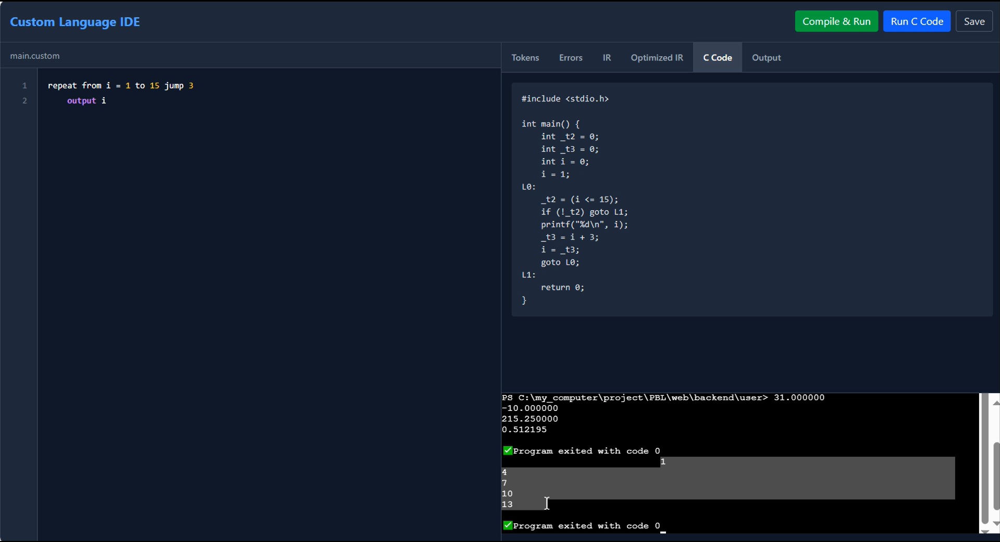
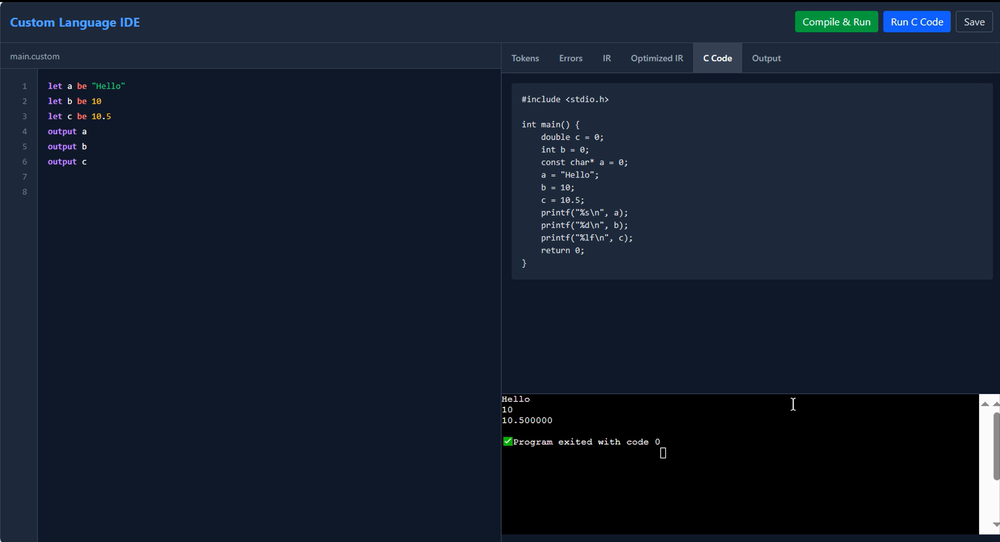

# **Compiler for Custom Programming Language**

## **Description**
This project is a Compiler for our own Programming language named "Codepie". The compiler is built using c++. It also includes a fully functional Graphical User Interface (GUI) built using Vite and React, allowing users to write code in Codepie and view tokens, errors, Intermediate Representation(IR), Optimized IR, Corresponding C code and the output in different sections all within the GUI environment. The Compiler also allows the Generated code to be executed directly from the interface.

## **Features**

- Custom Programming language: A new simple to use and understand language "Codepie".
- Lexical Analysis: Tokenization of the Codepie code.
- Syntax Analysis: Parsing of the Codepie code which detects syntax errors with line numbers.
- Semantic Analysis: Checks for semantic errors such as undefined variables, type mismatches etc.
- Intermediate Representation (IR): Shows Intermediate Representation of the Codepie code.
- Code Optimization: Optimizes the IR for better performance.
- Code Generation: Generates C code from the optimized IR.
- Execution Support: Executes the generated C code directly from the GUI interface.
- User Interface: A fully functional GUI built using Vite and React for interacting with the user.

## **Project Structure**

```
compiler-design-PBL/
├── backend/
│   └── compiler/
│   |    ├── include/                   # Header files for compiler components
│   |    │   ├── Lexer.h
│   |    │   ├── CodeGenerator.h
│   |    │   ├── IntermediateCodeGen.h
│   |    │   ├── Optimizer.h
│   |    │   ├── Parser.h
│   |    │   ├── SemanticAnalyzer.h
│   |    │   ├── UI.h
│   |    │   └── Utils.h
│   |    ├── src/                       # Source files for compiler components
│   |    │   ├── CodeGenerator.cpp
│   |    │   ├── IntermediateCodeGen.cpp
│   |    │   ├── Lexer.cpp
│   |    │   ├── main.cpp
│   |    │   ├── Optimizer.cpp
│   |    │   ├── Parser.cpp
│   |    │   └── SemanticAnalyzer.cpp
│   |    └── compiler.exe               # Compiled C++ executable
|   ├── user
|   ├── .gitignore
|   ├── server.js                      # Node.js server to interface backend and frontend
|   ├── package.json                   # Backend dependencies
|   └── package-lock.json
|
├── frontend/                             # Frontend (Vite + React)
│   ├── public/
│   │   └── vite.svg
│   ├── src/
│   │   ├── assets/
│   │   │   ├── react.svg
│   │   ├── component/                 # React components
│   │   │   ├── CodeEditor.jsx
│   │   │   ├── CompilationTab.jsx
│   │   │   ├── Terminal.tsx
│   │   │   └── Terminal2.jsx
│   │   ├── hooks/
│   │   │   └── use-toast.jsx          # Custom React hook
│   │   ├── App.css
│   │   ├── App.jsx
│   │   ├── index.css
│   │   ├── main.jsx
│   │   └── socket.js                  # WebSocket client
│   ├── .gitignore
│   ├── eslint.config.js              # Linting rules
│   ├── package.json                  # Frontend dependencies
│   ├── package-lock.json
│   ├── index.html
│   ├── vite.config.js                # Vite configuration
│   ├── README.md                     # Frontend-specific documentation
└── readme.md                         # (global README)
```

## **Screenshots And Videos**



#### **Video Deonstration**
[](assets/Codepie_demonstration.mp4)

## **Getting Started**

### **Prerequisites**
Make sure the following are installed on your system:

- For Backend (C++ Compiler)
  - C++17 or higher
  - Compiler like g++ or clang

- For Server (Node.js Bridge)
  - Node.js (v16 or above recommended)
  - npm (Node Package Manager)

- For Frontend (Vite + React UI)
  - Node.js & npm (same as above)

- Modern Browser (e.g., Chrome, Edge, Firefox)

### **Build Instructions**

1. Navigate to the folder compiler-design-PBL by using the command `cd compiler-design-PBL`
2. Clone the repository using `git clone -b compiler_final https://github.com/satyam1024/compiler-design-PBL.git`
3. Please note that our code has many branches but the final code is in compiler_final branch and, so the clone command has been written accordingly.
4. Navigate to the frontend directory using `cd compiler-design-PBL/frontend`
5. run the command `npm i`
6. then run `npm run dev` to start the frontend development server
7. then open a new command prompt and navigate to the backend directory using `cd compiler-design-PBL/backend`
8. run the command `npm i`
9. then run `nodemon server.js` to start the server
10. open the browser tab where the frontend is running and use the UI to write the code in codepie.

## **Language Specification**

This section defines the syntax and semantics of codepie supported by our compiler.

### **Keywords**
| Category                  | Keywords                                                      |
| ------------------------- | ------------------------------------------------------------- |
| **Variable Declaration**  | `let`, `be`                                                   |
| **Input/Output**          | `input`, `output`                                             |
| **Arithmetic Operations** | `add`, `subtract`, `multiply`, `divide`, `store`, `in`, `and` |
| **Control Flow**          | `if`, `then`, `else`, `otherwise`                             |
| **Looping**               | `repeat`, `from`, `to`, `jump`, `until`                       |


### **Datatypes**
Codepie supports type interference so you don't need to explicitly declare the type of a variable.

### **Statements Supported**
➤ Variable Declaration
```
    let x be 10
    let name be "Gautam"
```

➤ Input Statement
```
    input value
```

➤ Output Statement
```
    output x
    output "Hello, World"
```

➤ Arithmetic Operations
```
    add a and b store in result
    subtract x and y store in diff
    multiply p and q store in product
    divide total and count store in avg
```

#### **Control Flow**
➤ Conditional Statements
```
if x < y then
    output "x is less"
otherwise
    output "x is not less"
```

Supports:
- Simple if
- otherwise as else
- else if as else if chain with another if

➤ Loops
1. Counting Loop (like a for loop):
    ```
    repeat from i = 1 to 10 jump 1
        output i
    ```

2. Conditional Loop (like a while loop):
    ```
    repeat until x < 5
        output x
    ```

### **Expressions**
- Relational Operators: <, >, <=, >=, ==, !=
- Operands: Identifiers, Numbers, Strings

Example:
```
if a == b then ...
```

### **Error Handling**
- Unexpected tokens and syntax mismatches are reported with line numbers.
- Unterminated strings, missing keywords, and invalid expressions generate descriptive error messages

## **Sample Programs**

### **Sample 1**
    let a be "Hello"
    let b be 10
    let c be 10.5
    output a
    output b
    output c

### **Sample 2**
    let a be 10.5
    let b be 20.5
    add a and b store in sum
    subtract a and b store in diff
    multiply a and b store in c
    divide a and b store in d
    output sum
    output diff
    output c
    output d

### **Sample 3**
    let a be "Hello"
    let b be "World"
    add a and b store in sum
    output sum

### **Sample 4**
    let a be "Hello"
    let b be 20
    add a and b store in sum
    output sum

### **Sample 5**
    let a be 10
    let b be 5
    if a>b then
        output a
    otherwise
        output b

### **Sample 6**
    repeat from i=1 to 15 jump 3
        output i

## **Technologies Used**
- C++ - Core compiler Logic
- Node.js - Server to bridge frontend and compiler
- React+Vite - Fast and mordern UI for code editing and output display
- HTML/CSS/JS – UI styling and interactions
- npm - Dependency management for server and frontend

## **Output Sections (in UI)**
- Tokens
- Errors
- Intermediate Representation
- Optimized IR
- Generated C Code
- Program Output

## **Team - "The Resilient Coders"**
- Team Lead : [Gautam Saxena](https://github.com/GautamSaxena703)
- Team member 1 : [Satyam Kathait](https://github.com/satyam1024)
- Team member 2 : [Gaurav Singh](https://github.com/GauravSinghhhh)
- Team member 3 : [Abhishek Kamboj](https://github.com/Abhishek130900)

